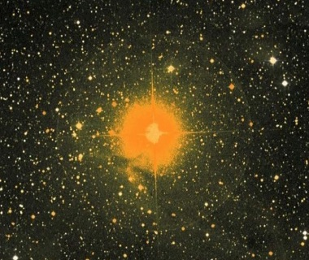

<!--
Copyright (c) 2022 Paul Barker
SPDX-License-Identifier: CC-BY-4.0
-->

# Introduction

*Image of μ Cephei, aka "Erakis" or "Herschel's Garnet Star".
From [Wikimedia Commons](https://commons.wikimedia.org/wiki/File:Erakis_(Garnet_Sidus).jpg),
public domain.*

{{#include ../README.md:8:}}
